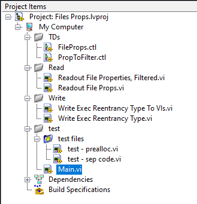

# LabVIEW File Properties Editor 

 

VI Scripting tool for reading and editing file properties (execution, reentrancy, filename, compiled code, etc).  
It filters files by selected property for selected folder and its subfolders.  
Supported files:  
- .vi 
- .ctl

Published also as an [NI Example](https://forums.ni.com/t5/Example-Code/LabVIEW-File-Properties-Editor/ta-p/4289814)

### Table of Contents (Wiki)
[Wiki Home](https://github.com/etfovac/lv_file_props/wiki)  
[Overview](https://github.com/etfovac/lv_file_props/wiki/Overview)  
[Notes](https://github.com/etfovac/lv_file_props/wiki/Notes)  
[Examples](https://github.com/etfovac/lv_file_props/wiki/Examples)  
[References](https://github.com/etfovac/lv_file_props/wiki/References)  

### Overview: Screenshots  
 
<b>Main.vi</b> is an Example that targets the repo's folder and subfolders, including the test files.  
 
  
  
Use <b>Readout File Properties, Filtered.vi</b> to readout file properties of some other folder.  
 
  

 
  
  

### Notes: Reentrancy  
To write (set) file's Reentrancy it needs to be loaded, recompiled and saved.    
  
  

[lv_file_props](https://github.com/etfovac/lv_file_props) is maintained by [etfovac](https://github.com/etfovac).
